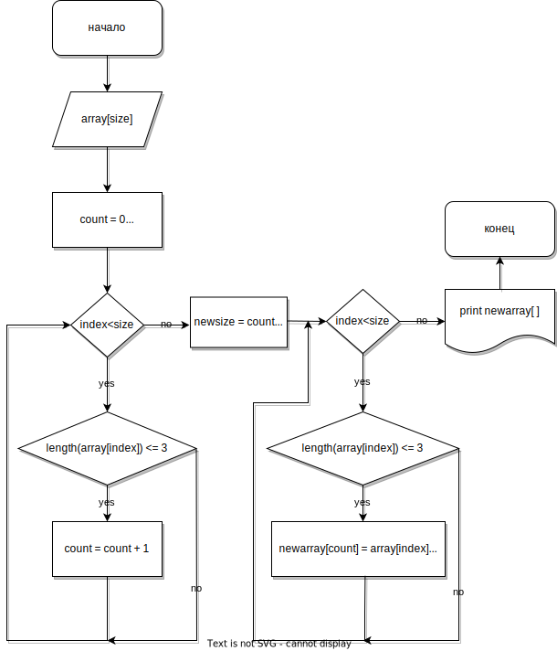

# Финальный проект 1 четверть. Geekbrains профессия разработчик.

## Итоговая проверочная работа.

1.	Создать репозиторий на GitHub
2.	Нарисовать блок-схему алгоритма (можно обойтись блок-схемой     основной содержательной части, если вы выделяете ее в отдельный метод)
3.	Снабдить репозиторий оформленным текстовым описанием решения файл Readme.md
4.	Написать программу, решающую поставленную задачу
5.	Использовать контроль версий в работе над этим небольшим проектом (не должно быть так что все залито одним коммитом, как минимум этапы 2,3 и 4 должны быть расположены в разных коммитах)

## Задача.
Написать программу, которая из имеющегося массива строк формирует массив из строк, длина которых меньше либо равна 3 символа. Первоначальный массив можно ввести с клавиатуры, либо задать на старте выполнения алгоритма. При решении не рекомендуется пользоваться коллекциями, лучше обойтись исключительно массивами.

## Пример.
1. [ "hello", "2", "world", ":-)" ] --> [ "2", ":-)" ]
2. [ "1234", "1567", "-2", "computer science" ] --> [ "-2" ]
3. [ "Russia", "Denmark", "Kazan" ] --> [ ]

## Язык реализации.
 С#

## Блок схема алгоритма

## Описание методов
* __int OutIntDigit(string info)__
  
  получает на вход информационную строку,ждет от пользователя ввода значения которое из строки преобразует в целое число если возможно, если нет требует повторить ввод  

* __string [ ] CreateArrayRandomString(int n)__

  принимает на вход целое число являющееся длиной массива 
  отдает строковый массив запоненный случайными русскими буквами
  длина строки(элемента массива) не больше 10
 
* __string [ ] CreateShortArray(string [ ] array, int lengthnewarray)__

  принимает на вход массив строк и длину отдаваемого строкового массива элементы отдаваемого массива имеют длину не более 3 символов и состоят из массива подоваемого на вход

* __void PrintArrayString(string info, string[ ] array)__

  принимает на вход информационную строку и массив
  производит печать элементов полученного на вход массива

* __int FindElementsArrayLengthLessFour(string [ ] array)__
   
   принимает на вход массив строк и находит в массиве количество элементов длиной не более 3 символов, отдает количество найденых элементов 
 